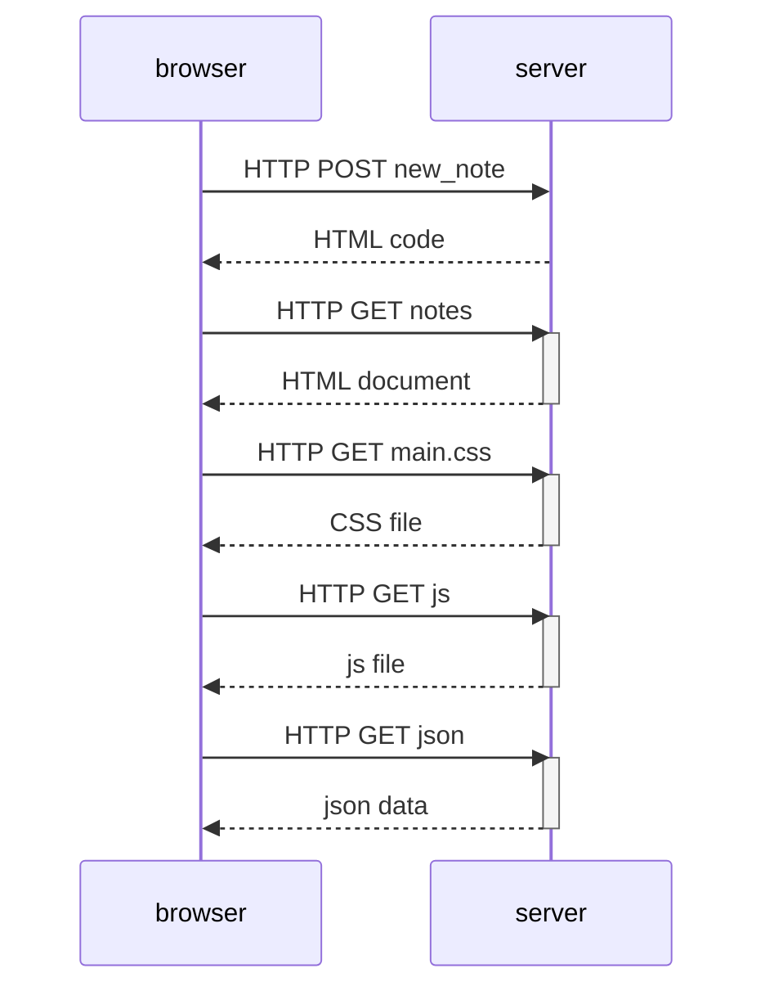

```mermaid
sequenceDiagram
  participant browser
  participant server

  browser->>server: HTTP POST new_note
  server-->>browser: HTML code
  browser->>server: HTTP GET notes
  activate server
  server-->>browser: HTML document
  deactivate server
  browser->>server: HTTP GET main.css
  activate server
  server-->>browser: CSS file
  deactivate server
  browser->>server: HTTP GET js
  activate server
  server-->>browser: js file
  deactivate server
  browser->>server: HTTP GET json
  activate server
  server-->>browser: json data
  deactivate server


  
```
