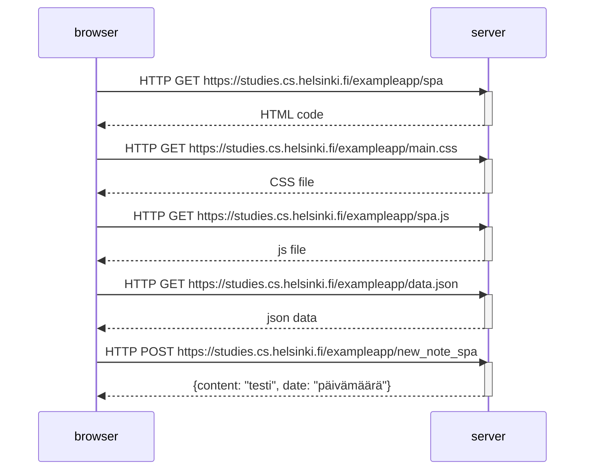

```mermaid
sequenceDiagram
  participant browser
  participant server

  browser->>server: HTTP GET https://studies.cs.helsinki.fi/exampleapp/spa
  activate server
  server-->>browser: HTML code
  deactivate server
  browser->>server: HTTP GET https://studies.cs.helsinki.fi/exampleapp/main.css
  activate server
  server-->>browser: CSS file
  deactivate server
  browser->>server: HTTP GET https://studies.cs.helsinki.fi/exampleapp/spa.js
  activate server
  server-->>browser: js file
  deactivate server
  browser->>server: HTTP GET https://studies.cs.helsinki.fi/exampleapp/data.json
  activate server
  server-->>browser: json data
  deactivate server
  browser->>server: HTTP POST https://studies.cs.helsinki.fi/exampleapp/new_note_spa
  activate server
  server-->>browser: {content: "testi", date: "päivämäärä"}
  deactivate server

```
